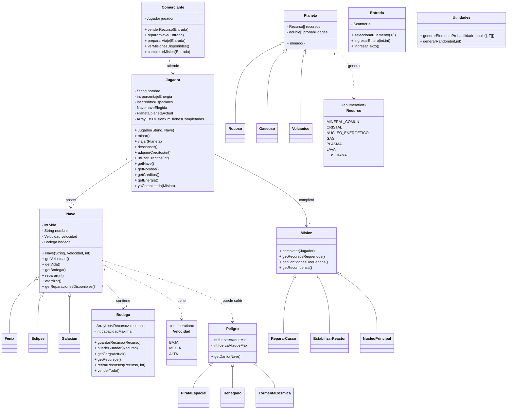

# Diagrama de clases (Mermaid)

```mermaid
classDiagram
    %% Domain entities

    class Jugador {
        - String nombre
        - int porcentajeEnergia
        - int creditosEspaciales
        - Nave naveElegida
        - Planeta planetaActual
        - ArrayList~Mision~ misionesCompletadas
        + Jugador(String, Nave)
        + minar()
        + viajar(Planeta)
        + descansar()
        + adquirirCreditos(int)
        + utilizarCreditos(int)
        + getNave()
        + getNombre()
        + getCreditos()
        + getEnergia()
        + yaCompletada(Mision)
    }

    class Nave {
        - int vida
        - String nombre
        - Velocidad velocidad
        - Bodega bodega
        + Nave(String, Velocidad, int)
        + getVelocidad()
        + getVida()
        + getBodega()
        + reparar(int)
        + aterrizar()
        + getReparacionesDisponibles()
    }

    class Bodega {
        - ArrayList~Recurso~ recursos
        - int capacidadMaxima
        + guardarRecurso(Recurso)
        + puedeGuardar(Recurso)
        + getCargaActual()
        + getRecursos()
        + retirarRecursos(Recurso, int)
        + venderTodo()
    }

    class Planeta {
        - Recurso[] recursos
        - double[] probabilidades
        + minado()
    }

    class Mision {
        + completar(Jugador)
        + getRecursosRequeridos()
        + getCantidadesRequeridas()
        + getRecompensa()
    }

    class Comerciante {
        - Jugador jugador
        + venderRecurso(Entrada)
        + repararNave(Entrada)
        + prepararViaje(Entrada)
        + verMisionesDisponibles()
        + completarMision(Entrada)
    }

    class Entrada {
        - Scanner s
        + seleccionarElemento(T[])
        + ingresarEntero(int,int)
        + ingresarTexto()
    }

    class Utilidades {
        + generarElementoProbabilidad(double[], T[])
        + generarRandom(int,int)
    }

    class Peligro {
        - int fuerzaAtaqueMin
        - int fuerzaAtaqueMax
        + getDanio(Nave)
    }

    %% Enums
    class Recurso {
        <<enumeration>>
        MINERAL_COMUN
        CRISTAL
        NUCLEO_ENERGETICO
        GAS
        PLASMA
        LAVA
        OBSIDIANA
    }

    class Velocidad {
        <<enumeration>>
        BAJA
        MEDIA
        ALTA
    }

    %% Jerarquías
    Mision <|-- RepararCasco
    Mision <|-- EstabilizarReactor
    Mision <|-- NucleoPrincipal

    Nave <|-- Fenix
    Nave <|-- Eclipse
    Nave <|-- Galaxian

    Peligro <|-- PirataEspacial
    Peligro <|-- Renegado
    Peligro <|-- TormentaCosmica

    Planeta <|-- Rocoso
    Planeta <|-- Gaseoso
    Planeta <|-- Volcanico

    %% Asociaciones (direccionales para minimizar cruces)
    Jugador "1" --> "1" Nave : posee
    Nave "1" --> "1" Bodega : contiene
    Jugador "1" --> "*" Mision : completó
    Nave "1" ..> Velocidad : tiene
    Nave "1" ..> Peligro : puede sufrir
    Planeta "1" ..> Recurso : genera
    Comerciante "1" ..> Jugador : atiende

    %% Layout notes: ordenar visualmente
    %% Coloca Jugador y Comerciante a la izquierda, Nave/Bodega en el centro, Planeta/Recursos/Peligros a la derecha
```
